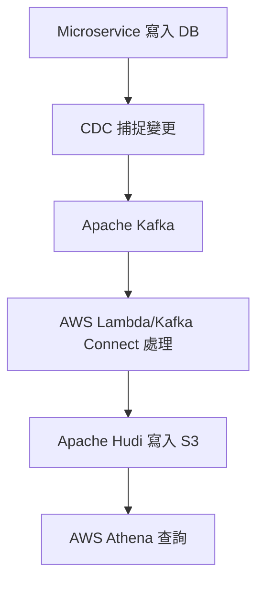

# 串接 Apache Kafka、Apache Hudi 與 AWS Athena 的即時資料查詢實務

[English](../en/11_analysis_pipeline_for_athena_practice.md) | [繁體中文](./11_analysis_pipeline_for_athena_practice.md) | [日本語](../ja/11_analysis_pipeline_for_athena_practice.md) | [回到索引](../README.md)

---

## 案例背景

在現代微服務架構下，常見需求是：每個 microservice 寫入資料庫時，資料也能同步進入資料湖，讓後續分析人員能用 AWS Athena 查詢。這個案例將介紹如何整合 Apache Kafka、Apache Hudi 與 AWS Athena，實現高效、可擴展的即時資料查詢管道。

## 架構總覽

1. **Microservice 資料寫入**
   - 各 microservice 寫入資料至各自的資料庫（如 Oracle、DynamoDB）。
2. **資料變更捕捉（CDC）**
   - 透過 CDC 工具（如 Oracle GoldenGate、Debezium、DynamoDB Streams）捕捉資料變更事件，推送至 Apache Kafka。
3. **Apache Kafka 事件流**
   - Kafka 作為事件中介，接收並分發所有資料變更事件。
4. **資料處理與寫入 Apache Hudi**
   - 使用 AWS Lambda 或 Kafka Connect 處理 Kafka 事件，轉換並寫入 Apache Hudi（儲存於 AWS S3）。
5. **AWS Athena 查詢**
   - Athena 查詢 S3 上的 Hudi 資料，支援 SQL 分析與報表。

## 詳細步驟

### 1. 資料變更捕捉（CDC）
- **Oracle**：用 Oracle GoldenGate 或 Debezium 捕捉資料變更，推送至 Kafka。
- **DynamoDB**：啟用 DynamoDB Streams，捕捉表中變更事件。

### 2. Kafka 中介層設計
- 部署 Kafka 集群，接收來自 CDC 工具的事件。
- 為每個資料來源設計對應的 Kafka Topic。

### 3. 資料處理與寫入 Apache Hudi
- **AWS Lambda 處理**：Lambda 監聽 Kafka Topic，觸發後將事件轉換為 Hudi 格式並寫入 S3。
- **Kafka Connect 處理**：部署 Hudi Sink Connector，直接將 Kafka Topic 資料寫入 Hudi 表，適合高吞吐量需求。

### 4. AWS Athena 查詢 Hudi 資料
- 在 AWS Glue Data Catalog 註冊 Hudi 表結構。
- 使用 Athena 查詢 S3 上的 Hudi 表，支援 SQL 分析。

## 總結與實務建議

這個架構能有效實現資料變更的即時捕捉、處理、存儲與查詢，適合需要高效資料處理與分析的場景。建議：
- CDC 工具選擇依據資料庫類型與預算
- Kafka Topic 設計要考慮資料來源與分區策略
- Hudi 表設計需根據查詢模式選擇合適的表類型（Copy-on-write 或 Merge-on-read）
- Athena 查詢前，建議先優化 Glue Catalog 與資料分區

---

此案例可作為企業導入即時資料湖查詢的參考架構。
