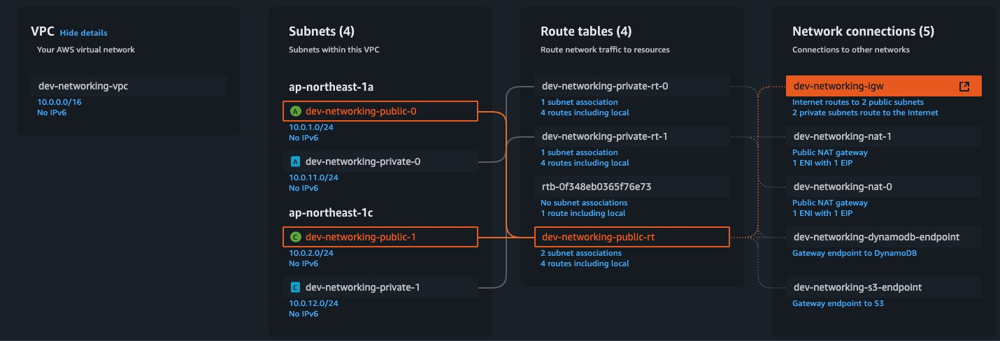

# AWS Route Table Design Discussion

[English](04_aws_route_table_design.md) | [繁體中文](../zh-tw/04_aws_route_table_design.md) | [日本語](../ja/04_aws_route_table_design.md) | [Back to Index](../README.md)



## Question 1: Why is there only one Public Route Table, but multiple Private Route Tables (by AZ)?

#### Reasons for having only one Public Route Table:
- The main purpose of Public Subnets is to provide internet access
- All public subnets need the same routing rules: connecting to the internet through Internet Gateway
- Therefore, one public route table is sufficient to handle all public subnet traffic

#### Reasons for needing multiple Private Route Tables:
- The main purpose of Private Subnets is to provide isolation for internal services
- Private subnets in each Availability Zone (AZ) need their own NAT Gateway
- This is because:
  - NAT Gateway is a regional service, each AZ needs its own NAT Gateway
  - For high availability, private subnets in each AZ should use the NAT Gateway in that AZ
  - Using NAT Gateway across AZs may cause:
    - Single point of failure risk
    - Cross-AZ network latency
    - Unnecessary cross-AZ traffic costs

#### Actual Operation:
```
Public Subnets:
Public Subnet (AZ-a) ──┐
Public Subnet (AZ-b) ──┼──> Single Public Route Table ──> Internet Gateway
Public Subnet (AZ-c) ──┘

Private Subnets:
Private Subnet (AZ-a) ──> Private Route Table (AZ-a) ──> NAT Gateway (AZ-a)
Private Subnet (AZ-b) ──> Private Route Table (AZ-b) ──> NAT Gateway (AZ-b)
Private Subnet (AZ-c) ──> Private Route Table (AZ-c) ──> NAT Gateway (AZ-c)
```

#### Benefits of this design:
- High Availability: Each AZ's private subnets have independent NAT Gateways
- Performance Optimization: Avoids cross-AZ network traffic
- Cost Efficiency: Reduces cross-AZ data transfer costs
- Fault Isolation: Issues in one AZ won't affect services in other AZs

## Question 2: Doesn't Public Route Table have cross-AZ single point of failure issues?

#### Public Route Table Single Point of Failure Risk:
- If the public route table has issues, all public subnets will be affected
- But this risk is relatively low because:
  - Route tables are fundamental AWS services with high availability
  - Route tables themselves are distributed, AWS automatically replicates them within the region
  - Route table failure probability is much lower than NAT Gateway

#### Why Public Route Table can be shared but Private Route Table cannot:

##### Public Subnet Traffic Pattern:
```
Public Subnet ──> Internet Gateway ──> Internet
```
- Internet Gateway is a regional service
- But it's a fundamental AWS service with extremely high availability
- Simple traffic pattern, only needs one exit point

##### Private Subnet Traffic Pattern:
```
Private Subnet ──> NAT Gateway ──> Internet Gateway ──> Internet
```
- NAT Gateway is a regional service and is a paid service
- Needs to handle more network translation work
- Complex traffic pattern, needs to consider:
  - Network Address Translation (NAT)
  - Connection Tracking
  - Rate Limiting
  - Performance Bottlenecks

#### Actual Risk Comparison:
- Public Route Table:
  - Failure Probability: Extremely Low
  - Impact Scope: All public subnets
  - Recovery Time: Usually Fast
  - Cost: No additional cost

- Private Route Table (if shared):
  - Failure Probability: Higher (due to NAT Gateway)
  - Impact Scope: All private subnets
  - Recovery Time: Longer
  - Cost: Cross-AZ traffic costs

## Question 3: Why is NAT Gateway more prone to failure?

#### NAT Gateway Complexity:
- NAT Gateway needs to handle:
  - Network Address Translation (NAT)
  - Connection Tracking
  - Rate Limiting
  - Packet Forwarding
- These operations all require resources and processing power

#### Resource Limitations:
- NAT Gateway has hardware limitations:
  - Maximum connections per NAT Gateway
  - Bandwidth limitations
  - Packets per second processing limits
- When these limits are reached, it may cause:
  - Connection rejections
  - Packet loss
  - Performance degradation

#### Network Traffic Patterns:
- NAT Gateway needs to handle:
  - Outbound Traffic
  - Inbound Traffic
  - Connection state maintenance
- These all require resources and processing power

#### Failure Causes:
- Hardware Failures:
  - Network interface card failure
  - Processor overload
  - Insufficient memory
- Software Issues:
  - Connection table full
  - Resource exhaustion
  - Software bugs
- Network Issues:
  - Network congestion
  - Routing problems
  - DNS resolution issues

#### Comparison with Internet Gateway:
- Internet Gateway:
  - Simple functionality: mainly routing
  - Low resource requirements: no need to maintain connection state
  - Low hardware requirements: no need for complex processing
- NAT Gateway:
  - Complex functionality: needs to handle NAT, connection tracking, etc.
  - High resource requirements: needs to maintain connection state table
  - High hardware requirements: needs higher processing power

#### High Availability Design:
- Using independent NAT Gateway for each AZ:
  - Load distribution
  - Fault isolation
  - Improved availability
- Using multiple NAT Gateways:
  - Avoid single point of failure
  - Provide load balancing
  - Improve performance

#### Monitoring and Maintenance:
- Need to monitor:
  - Connection count
  - Bandwidth usage
  - Packet processing rate
- Need to maintain:
  - Regular updates
  - Performance optimization
  - Troubleshooting

[English](04_aws_route_table_design.md) | [繁體中文](../zh-tw/04_aws_route_table_design.md) | [日本語](../ja/04_aws_route_table_design.md) | [Back to Index](../README.md) 