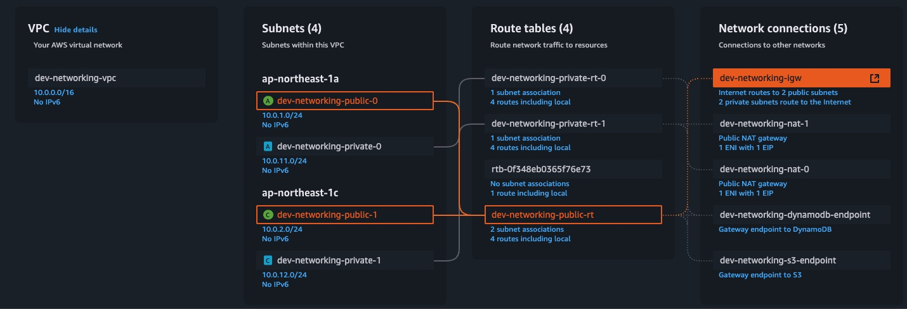

# AWS ルートテーブル設計の議論

[English](../en/04_aws_route_table_design.md) | [繁體中文](../zh-tw/04_aws_route_table_design.md) | [日本語](04_aws_route_table_design.md) | [索引に戻る](../README.md)



## 質問1：なぜパブリックルートテーブルは1つだけなのに、プライベートルートテーブルは複数（AZごと）あるのか？

#### パブリックルートテーブルが1つだけの理由：
- パブリックサブネットの主な目的はインターネットアクセスを提供すること
- すべてのパブリックサブネットは同じルーティングルールが必要：インターネットゲートウェイを通じてインターネットに接続
- したがって、1つのパブリックルートテーブルで全てのパブリックサブネットのトラフィックを処理できる

#### プライベートルートテーブルが複数必要な理由：
- プライベートサブネットの主な目的は内部サービスの分離を提供すること
- 各アベイラビリティゾーン（AZ）のプライベートサブネットは独自のNATゲートウェイが必要
- これは以下の理由による：
  - NATゲートウェイはリージョナルサービスで、各AZは独自のNATゲートウェイが必要
  - 高可用性のために、各AZのプライベートサブネットはそのAZのNATゲートウェイを使用すべき
  - AZをまたいでNATゲートウェイを使用すると：
    - 単一障害点のリスク
    - クロスAZのネットワーク遅延
    - 不要なクロスAZトラフィックコスト

#### 実際の動作：
```
パブリックサブネット：
Public Subnet (AZ-a) ──┐
Public Subnet (AZ-b) ──┼──> 単一のパブリックルートテーブル ──> インターネットゲートウェイ
Public Subnet (AZ-c) ──┘

プライベートサブネット：
Private Subnet (AZ-a) ──> プライベートルートテーブル (AZ-a) ──> NATゲートウェイ (AZ-a)
Private Subnet (AZ-b) ──> プライベートルートテーブル (AZ-b) ──> NATゲートウェイ (AZ-b)
Private Subnet (AZ-c) ──> プライベートルートテーブル (AZ-c) ──> NATゲートウェイ (AZ-c)
```

#### この設計の利点：
- 高可用性：各AZのプライベートサブネットは独立したNATゲートウェイを持つ
- パフォーマンス最適化：クロスAZのネットワークトラフィックを回避
- コスト効率：クロスAZのデータ転送コストを削減
- 障害分離：1つのAZの問題が他のAZのサービスに影響しない

## 質問2：パブリックルートテーブルにはクロスAZの単一障害点の問題はないのか？

#### パブリックルートテーブルの単一障害点リスク：
- パブリックルートテーブルに問題がある場合、すべてのパブリックサブネットが影響を受ける
- しかし、このリスクは比較的低い：
  - ルートテーブルはAWSの基本サービスで、高い可用性を持つ
  - ルートテーブル自体は分散型で、AWSはリージョン内で自動的に複製する
  - ルートテーブルの故障確率はNATゲートウェイよりはるかに低い

#### なぜパブリックルートテーブルは共有できるが、プライベートルートテーブルはできないのか：

##### パブリックサブネットのトラフィックパターン：
```
パブリックサブネット ──> インターネットゲートウェイ ──> インターネット
```
- インターネットゲートウェイはリージョナルサービス
- しかし、AWSの基本サービスで、極めて高い可用性を持つ
- シンプルなトラフィックパターン、出口点は1つだけ

##### プライベートサブネットのトラフィックパターン：
```
プライベートサブネット ──> NATゲートウェイ ──> インターネットゲートウェイ ──> インターネット
```
- NATゲートウェイはリージョナルサービスで、有料サービス
- より多くのネットワーク変換作業を処理する必要がある
- 複雑なトラフィックパターン、考慮すべき点：
  - ネットワークアドレス変換（NAT）
  - 接続追跡
  - レート制限
  - パフォーマンスボトルネック

#### 実際のリスク比較：
- パブリックルートテーブル：
  - 故障確率：極めて低い
  - 影響範囲：すべてのパブリックサブネット
  - 回復時間：通常は速い
  - コスト：追加コストなし

- プライベートルートテーブル（共有する場合）：
  - 故障確率：高い（NATゲートウェイのため）
  - 影響範囲：すべてのプライベートサブネット
  - 回復時間：長い
  - コスト：クロスAZトラフィックコスト

## 質問3：なぜNATゲートウェイは故障しやすいのか？

#### NATゲートウェイの複雑さ：
- NATゲートウェイは以下を処理する必要がある：
  - ネットワークアドレス変換（NAT）
  - 接続追跡
  - レート制限
  - パケット転送
- これらの操作はすべてリソースと処理能力を必要とする

#### リソース制限：
- NATゲートウェイにはハードウェア制限がある：
  - NATゲートウェイごとの最大接続数
  - 帯域幅制限
  - 1秒あたりのパケット処理制限
- これらの制限に達すると：
  - 接続拒否
  - パケットロス
  - パフォーマンス低下

#### ネットワークトラフィックパターン：
- NATゲートウェイは以下を処理する必要がある：
  - アウトバウンドトラフィック
  - インバウンドトラフィック
  - 接続状態の維持
- これらはすべてリソースと処理能力を必要とする

#### 故障の原因：
- ハードウェア故障：
  - ネットワークインターフェースカードの故障
  - プロセッサの過負荷
  - メモリ不足
- ソフトウェアの問題：
  - 接続テーブルの満杯
  - リソースの枯渇
  - ソフトウェアのバグ
- ネットワークの問題：
  - ネットワークの輻輳
  - ルーティングの問題
  - DNS解決の問題

#### インターネットゲートウェイとの比較：
- インターネットゲートウェイ：
  - シンプルな機能：主にルーティング
  - 低いリソース要件：接続状態の維持が不要
  - 低いハードウェア要件：複雑な処理が不要
- NATゲートウェイ：
  - 複雑な機能：NAT、接続追跡などを処理
  - 高いリソース要件：接続状態テーブルの維持が必要
  - 高いハードウェア要件：高い処理能力が必要

#### 高可用性設計：
- 各AZで独立したNATゲートウェイを使用：
  - 負荷分散
  - 障害分離
  - 可用性の向上
- 複数のNATゲートウェイを使用：
  - 単一障害点の回避
  - 負荷分散の提供
  - パフォーマンスの向上

#### モニタリングとメンテナンス：
- モニタリングが必要：
  - 接続数
  - 帯域幅使用量
  - パケット処理率
- メンテナンスが必要：
  - 定期的な更新
  - パフォーマンス最適化
  - トラブルシューティング

[English](../en/04_aws_route_table_design.md) | [繁體中文](../zh-tw/04_aws_route_table_design.md) | [日本語](04_aws_route_table_design.md) | [Back to Index](../README.md) 