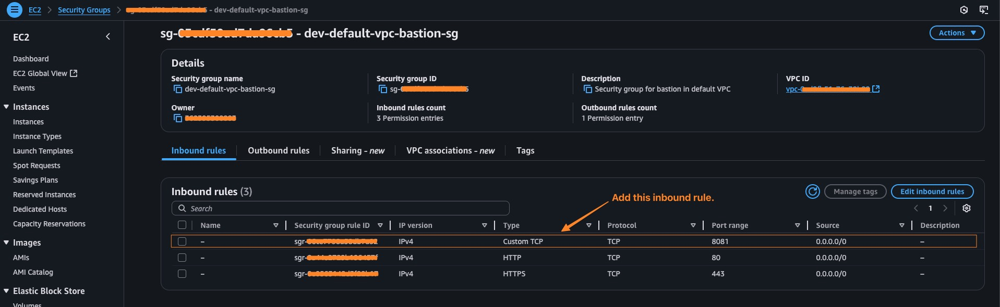

# Basic Docker Commands Practice

[English](../en/03_basic_docker_cmds.md) | [繁體中文](../zh-tw/03_basic_docker_cmds.md) | [日本語](../ja/03_basic_docker_cmds.md) | [Back to Index](../README.md)

## Environment Setup
First, let's confirm we're in an Amazon Linux 2 environment:
```bash
$ cat /etc/os-release
NAME="Amazon Linux"
VERSION="2"
ID="amzn"
ID_LIKE="centos rhel fedora"
VERSION_ID="2"
PRETTY_NAME="Amazon Linux 2"
ANSI_COLOR="0;33"
CPE_NAME="cpe:2.3:o:amazon:amazon_linux:2"
HOME_URL="https://amazonlinux.com/"
SUPPORT_END="2026-06-30"
```

## Docker Installation and Configuration
1. Install Docker:
```bash
$ sudo yum install docker -y
$ sudo docker --version
```

2. Verify current user and start Docker service:
```bash
# Assuming current user name is ssm-user
$ whoami
$ sudo service docker start
$ sudo service docker status | grep Active
```

3. Configure Docker permissions:
```bash
$ ls -l /var/run/docker.sock
# Add user to docker group to avoid using sudo every time
# usermod -aG: add user to group (-a for append, -G to specify group)
# newgrp: switch to new group immediately without requiring logout
$ sudo usermod -aG docker ssm-user && newgrp docker
```

## Basic Docker Operations
1. Check container status and test Docker:
```bash
$ docker ps
$ docker pull hello-world
$ docker images
$ docker run hello-world
```

2. Stop Docker service:
```bash
$ sudo service docker stop
$ sudo service docker status | grep Active
```

3. Remove image:
```bash
# Remember to stop and remove all related containers first
$ docker rmi alpine:3.16 
```

## Create Custom Image
1. Create Dockerfile:
```bash
$ vi Dockerfile
```

Dockerfile content:
```dockerfile
FROM alpine:3.16
RUN apk --update add apache2
RUN rm -rf /var/cache/apk/*
ENTRYPOINT ["httpd", "-D", "FOREGROUND"]
```

2. Build and run custom image:
```bash
$ docker build -t myimage .
$ docker images 
$ docker run -d -p 8081:80 --name container002 myimage 
$ docker container ls 
```
- After completion, you can access `[ec2_instance_public_id]:8081` in your browser to view the result
- If you cannot access it, it's usually because the EC2 security group inbound rule is not set. You can configure it as shown in the image below


## Docker Hub Operations
1. Push image to Docker Hub:
```bash
$ docker build -t your_docker_hub_account/myimage .
$ docker images
$ docker logout
$ docker login
$ docker push your_docker_hub_account/myimage
```

After completion, you can view the uploaded image on [Docker Hub](https://hub.docker.com/) 