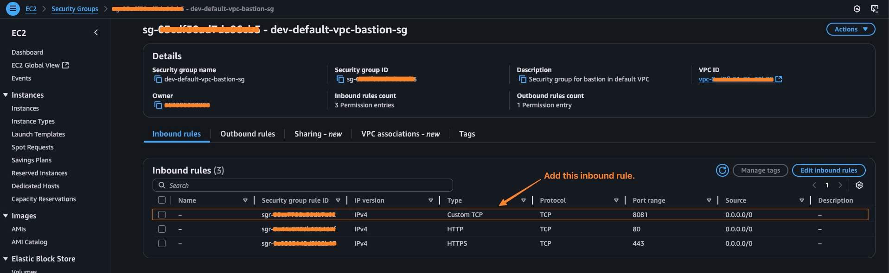

# Docker 基礎指令練習

[English](../en/03_basic_docker_cmds.md) | [繁體中文](../zh-tw/03_basic_docker_cmds.md) | [日本語](../ja/03_basic_docker_cmds.md) | [回到索引](../README.md)

## 環境準備
首先確認我們在 Amazon Linux 2 環境中：
```bash
$ cat /etc/os-release
NAME="Amazon Linux"
VERSION="2"
ID="amzn"
ID_LIKE="centos rhel fedora"
VERSION_ID="2"
PRETTY_NAME="Amazon Linux 2"
ANSI_COLOR="0;33"
CPE_NAME="cpe:2.3:o:amazon:amazon_linux:2"
HOME_URL="https://amazonlinux.com/"
SUPPORT_END="2026-06-30"
```

## Docker 安裝與設定
1. 安裝 Docker：
```bash
$ sudo yum install docker -y
$ sudo docker --version
```

2. 確認目前使用者並啟動 Docker 服務：
```bash
# 假設當前 user name 為 ssm-user
$ whoami
$ sudo service docker start
$ sudo service docker status | grep Active
```

3. 設定 Docker 權限：
```bash
$ ls -l /var/run/docker.sock
# 將使用者加入 docker 群組，這樣就不需要每次都使用 sudo
# usermod -aG：將使用者加入群組（-a 表示附加，-G 指定群組）
# newgrp：立即切換到新的群組，不需要重新登入
$ sudo usermod -aG docker ssm-user && newgrp docker
```

## 基本 Docker 操作
1. 查看容器狀態並測試 Docker：
```bash
$ docker ps
$ docker pull hello-world
$ docker images
$ docker run hello-world
```

2. 停止 Docker 服務：
```bash
$ sudo service docker stop
$ sudo service docker status | grep Active
```

3. 移除映像檔：
```bash
# 記得先停止並移除所有相關 containers
$ docker rmi alpine:3.16 
```

## 建立自訂映像檔
1. 建立 Dockerfile：
```bash
$ vi Dockerfile
```

Dockerfile 內容：
```dockerfile
FROM alpine:3.16
RUN apk --update add apache2
RUN rm -rf /var/cache/apk/*
ENTRYPOINT ["httpd", "-D", "FOREGROUND"]
```

2. 建立並執行自訂映像檔：
```bash
$ docker build -t myimage .
$ docker images 
$ docker run -d -p 8081:80 --name container002 myimage 
$ docker container ls 
```
- 完成後可以在瀏覽器存取 `[ec2_instance_public_id]:8081` 查看結果
- 如果無法存取，通常是因為 EC2 security group 沒設定 inbound rule，可以如下圖設定


## Docker Hub 操作
1. 推送映像檔到 Docker Hub：
```bash
$ docker build -t your_docker_hub_account/myimage .
$ docker images
$ docker logout
$ docker login
$ docker push your_docker_hub_account/myimage
```

完成後可以在 [Docker Hub](https://hub.docker.com/) 查看上傳的映像檔
