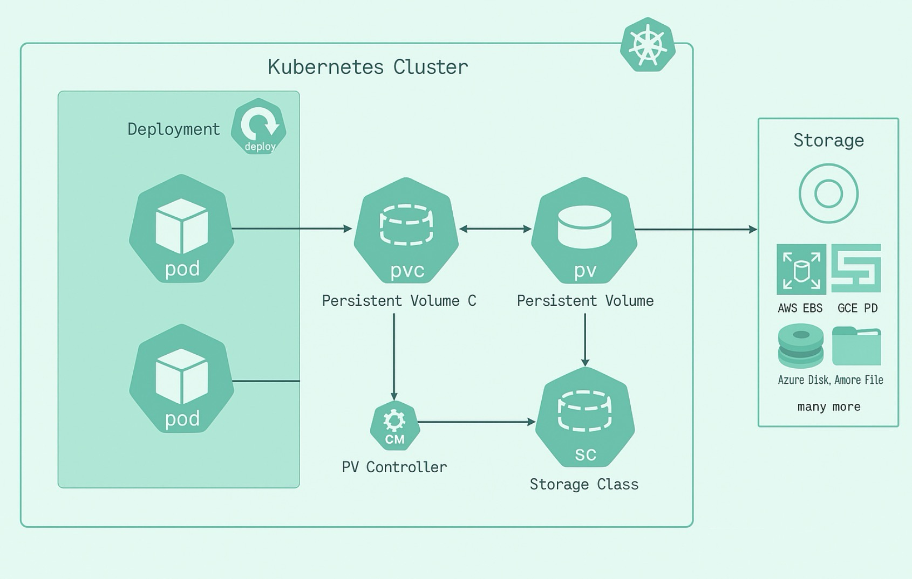

# Kubernetes PV, PVC, StorageClass Notes

[English](../en/21_k8s_pv_pvc_sc.md) | [繁體中文](../zh-tw/21_k8s_pv_pvc_sc.md) | [日本語](../ja/21_k8s_pv_pvc_sc.md) | [Back to Index](../README.md)

## Basic Concepts

- **Pod**: The smallest unit for running applications in Kubernetes, containing containers and capable of mounting volumes.
- **PVC (Persistent Volume Claim)**: Pods request storage resources through PVC, essentially serving as an "I need storage space" application.
- **PV (Persistent Volume)**: The actual resource that provides storage space, which can be created statically or dynamically.

## StorageClass

- **Purpose**: Defines storage resource types, parameters, and dynamic provisioning methods.
- **Common Scenario**: When a PVC specifies a StorageClass, Kubernetes automatically creates a corresponding PV based on that StorageClass configuration.
- **Example**: Different StorageClasses can be specified to choose different storage backends like SSD, HDD, cloud storage, etc.
- **Common Fields**:
  - `provisioner`: Specifies which plugin (such as nfs, csi) creates the storage.
  - `parameters`: Detailed settings (such as storage size, I/O type, etc.).

## Manual Create (Manual PV Creation)

- **Purpose**: Administrators pre-create PVs, specifying storage sources (such as local disks, NFS servers, etc.).
- **Process**:
  1. Administrators manually write PV YAML files and apply them to the cluster.
  2. Users create PVCs, and Kubernetes automatically binds PVCs to matching PVs.
- **Use Cases**: When precise control over storage resource sources is needed, or for special requirements.

## Provisioner (Dynamic Provisioning)

- **Purpose**: Responsible for automatically creating PVs based on StorageClass settings.
- **Common Provisioners**:
  - `kubernetes.io/aws-ebs`: AWS EBS
  - `kubernetes.io/gce-pd`: GCP Persistent Disk
  - `nfs.csi.k8s.io`: NFS
  - `csi.azure.com`: Azure Files
- **How it Works**:
  1. Users create PVCs and specify StorageClass.
  2. Provisioner automatically creates PVs and connects to physical storage based on StorageClass settings.
- **Advantages**: Automated, highly flexible, suitable for cloud or large-scale dynamic requirements.

## Supported Storage Backends

- **Local Storage**: hostPath
- **Cloud Storage**:
  - AWS EFS
  - GCP Filestore
  - Azure Files
- **Other Protocols**:
  - NFS
  - iSCSI
  - CSI (Container Storage Interface)

## Process Summary

1. Pod needs storage space and creates a PVC.
2. PVC looks for matching PVs (static or dynamic).
3. If dynamic, provisioner automatically creates PV based on StorageClass.
4. PV connects to actual storage backend (local or cloud).
5. Pod binds to PVC and ultimately mounts to storage space provided by PV.

## Simple Analogy

Roles
  - Pod (Tenant): Wants a place to live (store data) but doesn't need to know who the landlord is or where the address is, only cares about "lease" conditions.
  - PVC (Lease): A lease application written by the tenant based on requirements (space size, access permissions, etc.). As long as the contract terms match, they can directly use this contract to enter the room.
  - PV (Room/Warehouse/Physical Resource): The actual physical space (storage), which can be various hard drives, NFS, cloud storage, etc.
  - Kubernetes (Agent/Property Manager): Responsible for matching suitable rooms (PV) based on lease (PVC), and handles daily management and maintenance after pairing is complete.

How it Works
  - Pod only needs to submit a lease application (PVC), describing what kind of space they want.
  - Kubernetes will help find/build a suitable room (PV) and automatically match it for you.
  - Pod always accesses the room through the lease (PVC), never directly knowing the room's detailed information. This way, even if the room changes hands or relocates later, Pod doesn't need to change its access method.
  - The administrator (Kubernetes) makes resource scheduling very flexible and convenient for resource recycling, moving, or expansion.

Kubernetes' PVC rental process is like renting in Japan - the agent (Kubernetes) handles everything, the tenant (Pod) only manages the lease (PVC), and who the landlord (storage system behind PV) is doesn't concern the tenant.