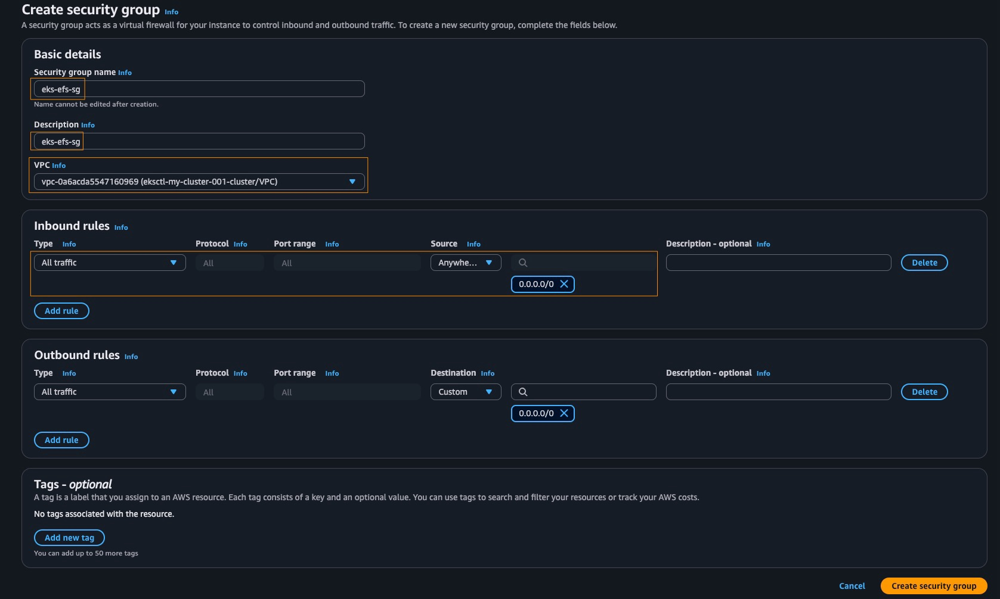
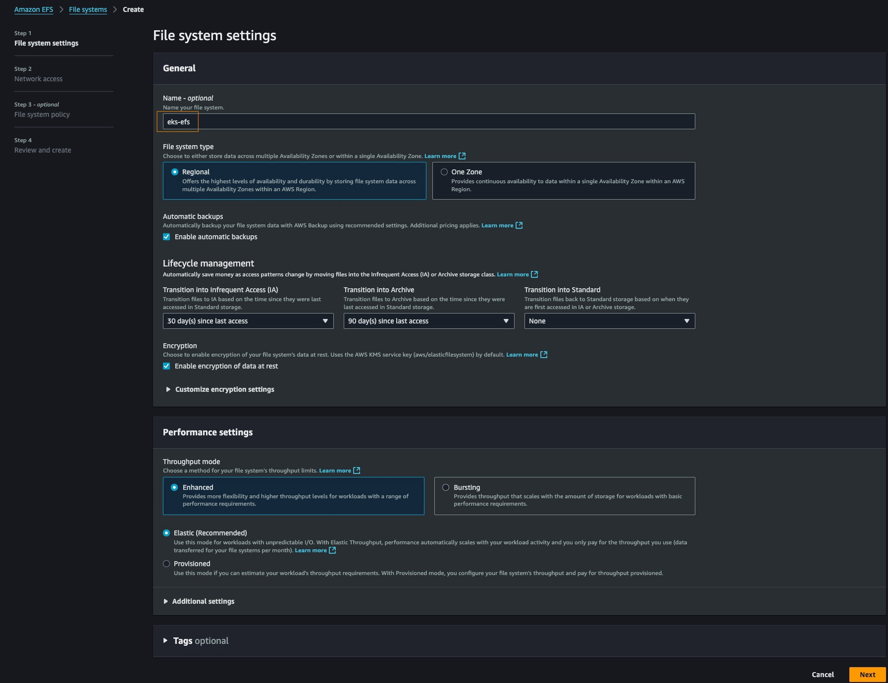
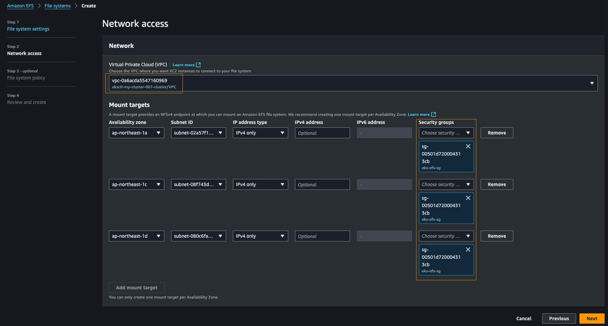
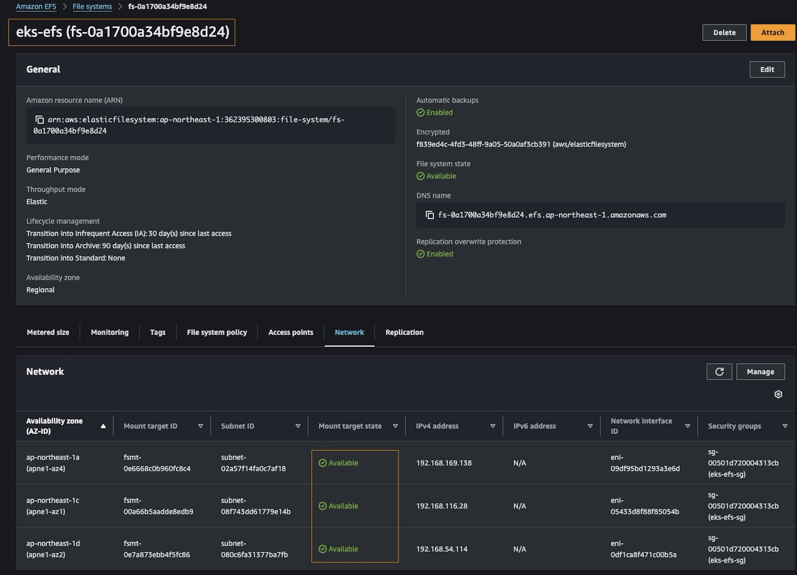

# AWS EKS Practical Guide

[English](../en/35_eks_practice.md) | [繁體中文](../zh-tw/35_eks_practice.md) | [日本語](../ja/35_eks_practice.md) | [Back to Index](../README.md)

## Table of Contents
1. [Environment Setup](#environment-setup)
2. [EKS Cluster Creation](#eks-cluster-creation)
3. [EFS Persistent Storage Configuration](#efs-persistent-storage-configuration)
4. [Load Balancer Controller Setup](#load-balancer-controller-setup)
5. [Multi-stage Deployment Project](#multi-stage-deployment-project)
6. [HPA Auto-scaling Configuration](#hpa-auto-scaling-configuration)
7. [Resource Cleanup](#resource-cleanup)

---

## Environment Setup

### Prerequisites
Before starting EKS implementation, you need to install the following tools:

#### kubectl Installation
```bash
$ curl -o kubectl https://s3.us-west-2.amazonaws.com/amazon-eks/1.33.0/2025-05-01/bin/linux/amd64/kubectl
$ chmod +x ./kubectl
$ mkdir -p $HOME/bin
$ cp ./kubectl $HOME/bin/kubectl
$ export PATH=$PATH:$HOME/bin
$ echo 'export PATH=$PATH:$HOME/bin' >> ~/.zshrc
$ kubectl version --short --client
```

#### eksctl Installation
```bash
$ mkdir ~/tmp
$ curl --silent --location "https://github.com/weaveworks/eksctl/releases/latest/download/eksctl_$(uname -s)_amd64.tar.gz" | tar xz -C ~/tmp
$ mv ~/tmp/eksctl $HOME/bin/eksctl
$ eksctl version
```

#### Helm Installation
```bash
$ curl -o get_helm.sh https://raw.githubusercontent.com/helm/helm/master/scripts/get-helm-3
$ chmod 700 get_helm.sh
$ ./get_helm.sh
$ helm version --short
```

#### Git Installation
```bash
$ sudo yum install -y git
```

#### AWS CLI Installation
```bash
$ aws --version
$ sudo rm -rf /usr/bin/aws
$ curl -o "awscliv2.zip" "https://awscli.amazonaws.com/awscli-exe-linux-x86_64.zip"
$ unzip awscliv2.zip
$ sudo ./aws/install
$ aws --version
```

### AWS Permission Configuration
```bash
$ aws configure
```

### Environment Variables Setup
```bash
$ CLUSTER_NAME=your_cluster_name
$ echo ${CLUSTER_NAME}

$ AWS_REGION=your_aws_region
$ echo ${AWS_REGION}

$ AWS_ACCOUNT=your_aws_account
$ echo ${AWS_ACCOUNT}
```

- All these configurations have been packaged in the [ssm_user_setup.sh](https://github.com/nekowanderer/nebuletta/blob/main/scripts/ssm_user_setup.sh) script. You can adjust the variables in the `Configurations` section and run it directly on EC2. For related instructions, please refer to this [link](https://github.com/nekowanderer/nebuletta/blob/main/scripts/ssm_user_setup.sh).
- After completion, you can also directly replace the `.zshrc` in your home directory with the content from [this location for convenience in the following exercises](https://github.com/nekowanderer/nebuletta/blob/main/scripts/custom_zshrc).

---

## EKS Cluster Creation
For detailed configuration in this step, please refer to [EKS Setup Configuration Guide](./36_eks_cluster_setup.md)

### Create Fargate Cluster
```bash
$ eksctl create cluster --name ${CLUSTER_NAME} --version 1.33 --fargate
2025-07-06 05:41:10 [ℹ]  eksctl version 0.210.0
2025-07-06 05:41:10 [ℹ]  using region ap-northeast-1
2025-07-06 05:41:11 [ℹ]  setting availability zones to [ap-northeast-1d ap-northeast-1c ap-northeast-1a]
2025-07-06 05:41:11 [ℹ]  subnets for ap-northeast-1d - public:192.168.0.0/19 private:192.168.96.0/19
2025-07-06 05:41:11 [ℹ]  subnets for ap-northeast-1c - public:192.168.32.0/19 private:192.168.128.0/19
2025-07-06 05:41:11 [ℹ]  subnets for ap-northeast-1a - public:192.168.64.0/19 private:192.168.160.0/19
2025-07-06 05:41:11 [ℹ]  using Kubernetes version 1.33
2025-07-06 05:41:11 [ℹ]  creating EKS cluster "my-cluster-001" in "ap-northeast-1" region with Fargate profile
2025-07-06 05:41:11 [ℹ]  if you encounter any issues, check CloudFormation console or try 'eksctl utils describe-stacks --region=ap-northeast-1 --cluster=my-cluster-001'
2025-07-06 05:41:11 [ℹ]  Kubernetes API endpoint access will use default of {publicAccess=true, privateAccess=false} for cluster "my-cluster-001" in "ap-northeast-1"
2025-07-06 05:41:11 [ℹ]  CloudWatch logging will not be enabled for cluster "my-cluster-001" in "ap-northeast-1"
2025-07-06 05:41:11 [ℹ]  you can enable it with 'eksctl utils update-cluster-logging --enable-types={SPECIFY-YOUR-LOG-TYPES-HERE (e.g. all)} --region=ap-northeast-1 --cluster=my-cluster-001'
2025-07-06 05:41:11 [ℹ]  default addons vpc-cni, kube-proxy, coredns, metrics-server were not specified, will install them as EKS addons
2025-07-06 05:41:11 [ℹ]
2 sequential tasks: { create cluster control plane "my-cluster-001",
    3 sequential sub-tasks: {
        1 task: { create addons },
        wait for control plane to become ready,
        create fargate profiles,
    }
}
2025-07-06 05:41:11 [ℹ]  building cluster stack "eksctl-my-cluster-001-cluster"
2025-07-06 05:41:11 [ℹ]  deploying stack "eksctl-my-cluster-001-cluster"
2025-07-06 05:41:41 [ℹ]  waiting for CloudFormation stack "eksctl-my-cluster-001-cluster"
2025-07-06 05:42:11 [ℹ]  waiting for CloudFormation stack "eksctl-my-cluster-001-cluster"
2025-07-06 05:43:11 [ℹ]  waiting for CloudFormation stack "eksctl-my-cluster-001-cluster"
2025-07-06 05:44:11 [ℹ]  waiting for CloudFormation stack "eksctl-my-cluster-001-cluster"
2025-07-06 05:45:11 [ℹ]  waiting for CloudFormation stack "eksctl-my-cluster-001-cluster"
2025-07-06 05:46:11 [ℹ]  waiting for CloudFormation stack "eksctl-my-cluster-001-cluster"
2025-07-06 05:47:11 [ℹ]  waiting for CloudFormation stack "eksctl-my-cluster-001-cluster"
2025-07-06 05:48:11 [ℹ]  waiting for CloudFormation stack "eksctl-my-cluster-001-cluster"
2025-07-06 05:49:11 [ℹ]  waiting for CloudFormation stack "eksctl-my-cluster-001-cluster"
2025-07-06 05:49:12 [!]  recommended policies were found for "vpc-cni" addon, but since OIDC is disabled on the cluster, eksctl cannot configure the requested permissions; the recommended way to provide IAM permissions for "vpc-cni" addon is via pod identity associations; after addon creation is completed, add all recommended policies to the config file, under `addon.PodIdentityAssociations`, and run `eksctl update addon`
2025-07-06 05:49:12 [ℹ]  creating addon: vpc-cni
2025-07-06 05:49:13 [ℹ]  successfully created addon: vpc-cni
2025-07-06 05:49:13 [ℹ]  creating addon: kube-proxy
2025-07-06 05:49:13 [ℹ]  successfully created addon: kube-proxy
2025-07-06 05:49:14 [ℹ]  creating addon: coredns
2025-07-06 05:49:14 [ℹ]  successfully created addon: coredns
2025-07-06 05:49:15 [ℹ]  creating addon: metrics-server
2025-07-06 05:49:15 [ℹ]  successfully created addon: metrics-server
2025-07-06 05:51:15 [ℹ]  creating Fargate profile "fp-default" on EKS cluster "my-cluster-001"
2025-07-06 05:53:26 [ℹ]  created Fargate profile "fp-default" on EKS cluster "my-cluster-001"
2025-07-06 05:53:56 [ℹ]  "coredns" is now schedulable onto Fargate
2025-07-06 05:54:59 [ℹ]  "coredns" is now scheduled onto Fargate
2025-07-06 05:54:59 [ℹ]  "coredns" pods are now scheduled onto Fargate
2025-07-06 05:54:59 [ℹ]  waiting for the control plane to become ready
2025-07-06 05:55:00 [✔]  saved kubeconfig as "/home/ssm-user/.kube/config"
2025-07-06 05:55:00 [ℹ]  no tasks
2025-07-06 05:55:00 [✔]  all EKS cluster resources for "my-cluster-001" have been created
2025-07-06 05:55:03 [ℹ]  kubectl command should work with "/home/ssm-user/.kube/config", try 'kubectl get nodes'
2025-07-06 05:55:03 [✔]  EKS cluster "my-cluster-001" in "ap-northeast-1" region is ready
```

### Check Installation Results
```bash
$ cat .kube/config
apiVersion: v1
clusters:
- cluster:
    certificate-authority-data: LS0tLS1CRUdJTiBDRVJUSUZJQ0FURS0tLS0tCk1JSURCVENDQWUyZ0F3SUJBZ0lJQjZKUVNvblViREl3RFFZSktvWklodmNOQVFFTEJRQXdGVEVUTUJFR0ExVUUKQXhNS2EzVmlaWEp1WlhSbGN6QWVGdzB5TlRBM01EWXdOVFF4TVRCYUZ3MHpOVEEzTURRd05UUTJNVEJhTUJVeApFekFSQmdOVkJBTVRDbXQxWW1WeWJtVjBaWE13Z2dFaU1BMEdDU3FHU0liM0RRRUJBUVVBQTRJQkR3QXdnZ0VLCkFvSUJBUURKKzRrZ2YxMHlXVVZINmw0Wmd6Z3NWc3YyV3VKTUNnQ1oyb3YvSjRoNXlmeUVqamlyRXBKdEVZUzQKbW81ZUR1Y0VjRCtqRHEwNDltQ1BNUGlmcHFQZ3JGU2tmMlNtQktFM1B6Y2ZkUWRxRmx3d0VhUnhBTzQ5WEx2eAp1Yk9kYTRFTGdMNnIzNm82YlFXL0FoQXNUYzV2NGJzY2NoeWkvYm5XY0dXNGpJZUJXd2dxb1J4SEpLQlRqN0p5Cm1LV0lFUEdpdXNsUG8yWTlLdEJudlFvMTJxd3RKT01Ma3V1ZUlmR0E1R09PbnVuTy9DS09Ick5LTk1INkpldUgKcXQ2M09YZ3lUVWUvclVQMzJHbTZqZUdnR1RISWpVS3NObHRLVk4zVzlFVjdPa3dVME83MkxpS05NdkdJM2x5QQpUVWN4bWN0WmhCYi9nUU5NYWh6dGRicHBtbDVCQWdNQkFBR2pXVEJYTUE0R0ExVWREd0VCL3dRRUF3SUNwREFQCkJnTlZIUk1CQWY4RUJUQURBUUgvTUIwR0ExVWREZ1FXQkJUejFZQlRqc1ZjZkFsYnk5TzBGWEh1OElXdEh6QVYKQmdOVkhSRUVEakFNZ2dwcmRXSmxjbTVsZEdWek1BMEdDU3FHU0liM0RRRUJDd1VBQTRJQkFRQTFtTWcyNktkUwpiUFdXbXMxdzl6WXdWdFYvSkF3OUFIaTRTaklRYUFOS2FLQUVoWi9ReEFUdWJ3bEZkOWtUK085bk11VmZzb0pLCmJrRTJyc25wZG1tYkxoQnhHeTVoVHUvMlE0Q0JOZHFuWldsRlo5bVNGNUFtZTh3WTNVcHkySmlsZ1JFMkM4eXgKM0F1MCttZU84RDFKSUpESGczZ25BbXBNemFsSVlnSXFHL215QjloZk1vVWZXR3pHRm56UW9mZ3d3OEs3cTkwNgpRUXVHWkxLZThldVJ5S1Y4VWVKUlF4MXhadzlEN1h0OEFycXplcys0dlpiRy96b2Q0ZXJCUGMxQmdLNGp3cXBhCkdpRVFHS2Z6L3B1N0dVWW1GRHZlRTczVTVSNDQ2Y0ROa29QL1QxRGh5N1hnOWpveUJWcVRDaHl4b3BBdk9xc0MKeXgwRENzcTgvYzVOCi0tLS0tRU5EIENFUlRJRklDQVRFLS0tLS0K
    server: https://8B8DC61011BE24084D76FEBB4DDDD9C3.sk1.ap-northeast-1.eks.amazonaws.com
  name: my-cluster-001.ap-northeast-1.eksctl.io
contexts:
- context:
    cluster: my-cluster-001.ap-northeast-1.eksctl.io
    user: i-0a4cd97300f5a0107@my-cluster-001.ap-northeast-1.eksctl.io
  name: i-0a4cd97300f5a0107@my-cluster-001.ap-northeast-1.eksctl.io
current-context: i-0a4cd97300f5a0107@my-cluster-001.ap-northeast-1.eksctl.io
kind: Config
preferences: {}
users:
- name: i-0a4cd97300f5a0107@my-cluster-001.ap-northeast-1.eksctl.io
  user:
    exec:
      apiVersion: client.authentication.k8s.io/v1beta1
      args:
      - eks
      - get-token
      - --output
      - json
      - --cluster-name
      - my-cluster-001
      - --region
      - ap-northeast-1
      command: aws
      env:
      - name: AWS_STS_REGIONAL_ENDPOINTS
        value: regional
      provideClusterInfo: false
```

### Check Components in kube-system namespace
```bash
$ kubectl get all -n kube-system
NAME                                  READY   STATUS    RESTARTS   AGE
pod/coredns-5ff77f65d4-jn6d9          1/1     Running   0          2m36s
pod/coredns-5ff77f65d4-pqwtk          1/1     Running   0          2m36s
pod/metrics-server-7f76d4758d-db2vs   0/1     Pending   0          5m41s
pod/metrics-server-7f76d4758d-sst8j   0/1     Pending   0          5m41s

NAME                                TYPE        CLUSTER-IP       EXTERNAL-IP   PORT(S)                  AGE
service/eks-extension-metrics-api   ClusterIP   10.100.83.197    <none>        443/TCP                  9m44s
service/kube-dns                    ClusterIP   10.100.0.10      <none>        53/UDP,53/TCP,9153/TCP   6m12s
service/metrics-server              ClusterIP   10.100.122.161   <none>        443/TCP                  5m41s

NAME                        DESIRED   CURRENT   READY   UP-TO-DATE   AVAILABLE   NODE SELECTOR   AGE
daemonset.apps/aws-node     0         0         0       0            0           <none>          5m43s
daemonset.apps/kube-proxy   0         0         0       0            0           <none>          5m43s

NAME                             READY   UP-TO-DATE   AVAILABLE   AGE
deployment.apps/coredns          2/2     2            2           6m12s
deployment.apps/metrics-server   0/2     2            0           5m41s

NAME                                        DESIRED   CURRENT   READY   AGE
replicaset.apps/coredns-5c658475b5          0         0         0       6m12s
replicaset.apps/coredns-5ff77f65d4          2         2         2       2m36s
replicaset.apps/metrics-server-7f76d4758d   2         2         0       5m41s
```
- The most important component here is coredns, which helps us handle domain name related processing.

### Create OIDC Provider
```bash
$ eksctl utils associate-iam-oidc-provider --cluster ${CLUSTER_NAME} --approve
2025-07-06 05:56:55 [ℹ]  will create IAM Open ID Connect provider for cluster "my-cluster-001" in "ap-northeast-1"
2025-07-06 05:56:56 [✔]  created IAM Open ID Connect provider for cluster "my-cluster-001" in "ap-northeast-1"
```

### Delete EKS Cluster 
There are many related exercises ahead. If you're worried about costs, delete it first and recreate it when needed:
```bash
$ eksctl delete cluster --region=ap-northeast-1 --name=my-cluster-001
2025-07-06 06:00:02 [ℹ]  deleting EKS cluster "my-cluster-001"
2025-07-06 06:00:03 [ℹ]  deleting Fargate profile "fp-default"
2025-07-06 06:02:11 [ℹ]  deleted Fargate profile "fp-default"
2025-07-06 06:02:11 [ℹ]  deleted 1 Fargate profile(s)
2025-07-06 06:02:11 [✔]  kubeconfig has been updated
2025-07-06 06:02:11 [ℹ]  cleaning up AWS load balancers created by Kubernetes objects of Kind Service or Ingress
2025-07-06 06:02:12 [ℹ]
2 sequential tasks: { delete IAM OIDC provider, delete cluster control plane "my-cluster-001" [async]
}
2025-07-06 06:02:13 [ℹ]  will delete stack "eksctl-my-cluster-001-cluster"
2025-07-06 06:02:13 [✔]  all cluster resources were deleted
```

---

## EFS Persistent Storage Configuration

### Create Security Group


- Name: `eks-efs-sg`
- Select EKS cluster's VPC
- Allow all connections

### Create EFS File System




- Name: `eks-efs`
- Select EKS cluster's VPC
- Update mount targets, use Security Group: `eks-efs-sg`
- Wait for mount targets to become available

### Install EFS CSI Driver
```bash
$ kubectl apply -f https://raw.githubusercontent.com/kubernetes-sigs/aws-efs-csi-driver/master/deploy/kubernetes/base/csidriver.yaml
csidriver.storage.k8s.io/efs.csi.aws.com configured

$ kubectl get csidriver
NAME              ATTACHREQUIRED   PODINFOONMOUNT   STORAGECAPACITY   TOKENREQUESTS   REQUIRESREPUBLISH   MODES        AGE
efs.csi.aws.com   false            false            false             <unset>         false               Persistent   24m
```

### Create Persistent Volume (PV)
```bash
$ git clone https://github.com/uopsdod/k8sOnCloud_hiskio.git
$ cd ~/k8sOnCloud_hiskio/aws_eks/initial
$ cp simple-volume-pv.yaml aws-efs-volume-pv.yaml
```

Edit `aws-efs-volume-pv.yaml`:
```yaml
apiVersion: v1
kind: PersistentVolume
metadata:
  name: app-pv
spec:
  storageClassName: sc-001
  volumeMode: Filesystem
  capacity:
    storage: 2Gi
  accessModes:
    - ReadWriteMany
  csi:
    driver: efs.csi.aws.com
    volumeHandle: fs-0a1700a34bf9e8d24  # Replace with your EFS file system ID
```

### Deploy PV and PVC
```bash
$ kubectl apply -f aws-efs-volume-pv.yaml
persistentvolume/app-pv created

$ kubectl get pv
NAME     CAPACITY   ACCESS MODES   RECLAIM POLICY   STATUS      CLAIM   STORAGECLASS   VOLUMEATTRIBUTESCLASS   REASON   AGE
app-pv   2Gi        RWX            Retain           Available           sc-001         <unset>                          16s

$ kubectl describe pv app-pv
Name:            app-pv
Labels:          <none>
Annotations:     <none>
Finalizers:      [kubernetes.io/pv-protection]
StorageClass:    sc-001
Status:          Available
Claim:
Reclaim Policy:  Retain
Access Modes:    RWX
VolumeMode:      Filesystem
Capacity:        2Gi
Node Affinity:   <none>
Message:
Source:
    Type:              CSI (a Container Storage Interface (CSI) volume source)
    Driver:            efs.csi.aws.com
    FSType:
    VolumeHandle:      fs-0a1700a34bf9e8d24
    ReadOnly:          false
    VolumeAttributes:  <none>
Events:                <none>  # Focus on this line, check for error messages
```

Edit `simple-volume-pvc.yaml`:

```yaml
apiVersion: v1
kind: PersistentVolumeClaim
metadata:
  name: app-pvc
spec:
  storageClassName: sc-001
  accessModes:
    - ReadWriteMany
  resources:
    requests:
      storage: 2Gi
```

```bash
$ kubectl apply -f simple-volume-pvc.yaml
persistentvolumeclaim/app-pvc created

$ kubectl get pvc
NAME      STATUS   VOLUME   CAPACITY   ACCESS MODES   STORAGECLASS   VOLUMEATTRIBUTESCLASS   AGE
app-pvc   Bound    app-pv   2Gi        RWX            sc-001         <unset>                 29s

$ kubectl describe pvc app-pvc
Name:          app-pvc
Namespace:     default
StorageClass:  sc-001
Status:        Bound
Volume:        app-pv
Labels:        <none>
Annotations:   pv.kubernetes.io/bind-completed: yes
               pv.kubernetes.io/bound-by-controller: yes
Finalizers:    [kubernetes.io/pvc-protection]
Capacity:      2Gi
Access Modes:  RWX
VolumeMode:    Filesystem
Used By:       <none>
Events:        <none> # Focus on this line, check for error messages
```

### Deploy Application
Edit `simple-deployment-volume.yaml`:

```yaml
apiVersion: apps/v1
kind: Deployment
metadata:
  name: app-deployment
spec:
  replicas: 3
  selector:
    matchLabels:
      app: app-pod
  template:
    metadata:
      labels:
        app: app-pod
    spec:
      containers:
      - name: app-container
        image: uopsdod/k8s-hostname-amd64-beta:v1
        ports:
        - containerPort: 80
        volumeMounts:
          - name: app-volume
            mountPath: /app/data
      volumes:
        - name: app-volume
          persistentVolumeClaim:
            claimName: app-pvc
```

```bash
$ kubectl apply -f simple-deployment-volume.yaml
deployment.apps/app-deployment created

$ kubectl get deployments
NAME             READY   UP-TO-DATE   AVAILABLE   AGE
app-deployment   0/3     3            0           22s

$ kubectl get pods -w
NAME             READY   UP-TO-DATE   AVAILABLE   AGE
app-deployment   0/3     3            0           25s
app-deployment   1/3     3            1           77s
app-deployment   2/3     3            2           80s
app-deployment   3/3     3            3           84s
```

### Test Persistent Storage
```bash
$ kubectl get pods
NAME                              READY   STATUS    RESTARTS   AGE
app-deployment-58449898c5-4fqws   1/1     Running   0          2m31s
app-deployment-58449898c5-7m54s   1/1     Running   0          2m31s
app-deployment-58449898c5-hbblt   1/1     Running   0          2m31s

$ kubectl exec -it [pod_name] -- touch /app/data/file003.txt
$ kubectl exec -it [pod_name] -- ls /app/data
file001.txt

$ kubectl delete pods --all
pod "app-deployment-58449898c5-4fqws" deleted
pod "app-deployment-58449898c5-7m54s" deleted
pod "app-deployment-58449898c5-hbblt" deleted

$ kubectl get pods -w
NAME                              READY   STATUS              RESTARTS   AGE
app-deployment-58449898c5-4jgxk   0/1     ContainerCreating   0          57s
app-deployment-58449898c5-mcsjj   0/1     ContainerCreating   0          57s
app-deployment-58449898c5-njmp8   0/1     ContainerCreating   0          57s
app-deployment-58449898c5-njmp8   1/1     Running             0          68s
app-deployment-58449898c5-mcsjj   1/1     Running             0          69s
app-deployment-58449898c5-4jgxk   1/1     Running             0          72s

$ kubectl exec -it [pod_name] -- ls /app/data
file001.txt
```

---

## Load Balancer Controller Setup

### Create IAM Policy
```bash
$ curl -o iam_policy.json https://raw.githubusercontent.com/kubernetes-sigs/aws-load-balancer-controller/main/docs/install/iam_policy.json

$ aws iam create-policy \
   --policy-name AWSLoadBalancerControllerIAMPolicy \
   --policy-document file://iam_policy.json

$ aws iam get-policy --policy-arn arn:aws:iam::${AWS_ACCOUNT}:policy/AWSLoadBalancerControllerIAMPolicy
{
  "Policy": {
    "PolicyName": "AWSLoadBalancerControllerIAMPolicy",
    "PolicyId": "ANPAVIYDROPBYUTZQRYZQ",
    "Arn": "arn:aws:iam::362395300803:policy/AWSLoadBalancerControllerIAMPolicy",
    "Path": "/",
    "DefaultVersionId": "v1",
    "AttachmentCount": 0,
    "PermissionsBoundaryUsageCount": 0,
    "IsAttachable": true,
    "CreateDate": "2025-07-11T13:42:41+00:00",
    "UpdateDate": "2025-07-11T13:42:41+00:00",
    "Tags": []
  }
}
```
- With this IAM policy, you can create a k8s service account

### Create Service Account
```bash
$ eksctl create iamserviceaccount \
  --cluster=${CLUSTER_NAME} \
  --namespace=kube-system \
  --name=aws-load-balancer-controller \
  --attach-policy-arn=arn:aws:iam::${AWS_ACCOUNT}:policy/AWSLoadBalancerControllerIAMPolicy \
  --override-existing-serviceaccounts \
  --approve
2025-07-11 13:47:34 [ℹ]  1 iamserviceaccount (kube-system/aws-load-balancer-controller) was included (based on the include/exclude rules)
2025-07-11 13:47:34 [!]  metadata of serviceaccounts that exist in Kubernetes will be updated, as --override-existing-serviceaccounts was set
2025-07-11 13:47:34 [ℹ]  1 task: {
    2 sequential sub-tasks: {
        create IAM role for serviceaccount "kube-system/aws-load-balancer-controller",
        create serviceaccount "kube-system/aws-load-balancer-controller",
    } }2025-07-11 13:47:34 [ℹ]  building iamserviceaccount stack "eksctl-my-cluster-001-addon-iamserviceaccount-kube-system-aws-load-balancer-controller"
2025-07-11 13:47:34 [ℹ]  deploying stack "eksctl-my-cluster-001-addon-iamserviceaccount-kube-system-aws-load-balancer-controller"
2025-07-11 13:47:34 [ℹ]  waiting for CloudFormation stack "eksctl-my-cluster-001-addon-iamserviceaccount-kube-system-aws-load-balancer-controller"
2025-07-11 13:48:04 [ℹ]  waiting for CloudFormation stack "eksctl-my-cluster-001-addon-iamserviceaccount-kube-system-aws-load-balancer-controller"
2025-07-11 13:48:04 [ℹ]  created serviceaccount "kube-system/aws-load-balancer-controller"
```
- Service account allows the load balancer controller to have the necessary permissions

```bash
$ eksctl get iamserviceaccount --cluster ${CLUSTER_NAME} --name aws-load-balancer-controller --namespace kube-system
NAMESPACE       NAME                            ROLE ARN
kube-system     aws-load-balancer-controller    arn:aws:iam::362395300803:role/eksctl-my-cluster-001-addon-iamserviceaccount-Role1-R6G3upoEDBOc
```
- Seeing this output indicates the service account was created successfully

### Install Load Balancer Controller
```bash
$ helm repo add eks https://aws.github.io/eks-charts
"eks" has been added to your repositories

$ curl -O https://raw.githubusercontent.com/aws/eks-charts/master/stable/aws-load-balancer-controller/crds/crds.yaml
  % Total    % Received % Xferd  Average Speed   Time    Time     Time  Current
                                 Dload  Upload   Total   Spent    Left  Speed
100 32484  100 32484    0     0   141k      0 --:--:-- --:--:-- --:--:--  141k

$ kubectl apply -f crds.yaml
customresourcedefinition.apiextensions.k8s.io/ingressclassparams.elbv2.k8s.aws created
customresourcedefinition.apiextensions.k8s.io/targetgroupbindings.elbv2.k8s.aws created

# Query the VPC ID used by the EKS cluster
$ aws eks describe-cluster --name ${CLUSTER_NAME} --query "cluster.resourcesVpcConfig.vpcId" --output json | jq
"vpc-0cf3a9effdea78521"

$ VPC_ID=vpc-0cf3a9effdea78521  # Replace with your VPC ID found above

$ echo ${VPC_ID}
```

- Everything is ready, you can create the load balancer controller:

```bash
$ helm install aws-load-balancer-controller eks/aws-load-balancer-controller \
    --set clusterName=${CLUSTER_NAME} \
    --set serviceAccount.create=false \
    --set region=${AWS_REGION} \
    --set vpcId=${VPC_ID} \
    --set serviceAccount.name=aws-load-balancer-controller \
    -n kube-system
NAME: aws-load-balancer-controller
LAST DEPLOYED: Fri Jul 11 14:01:09 2025
NAMESPACE: kube-system
STATUS: deployed
REVISION: 1
TEST SUITE: None
NOTES:
AWS Load Balancer controller installed!
```

- Observe the aws-load-balancer status and wait until ready:

```bash
$ kubectl get all -n kube-system
NAME                                                READY   STATUS    RESTARTS   AGE
pod/aws-load-balancer-controller-5b895c4dd6-7g2cm   1/1     Running   0          90s
pod/aws-load-balancer-controller-5b895c4dd6-lt7r4   1/1     Running   0          90s
pod/coredns-5ff77f65d4-4zv6x                        1/1     Running   0          38m
pod/coredns-5ff77f65d4-w9tjw                        1/1     Running   0          38m
pod/metrics-server-6f674c86fd-859m7                 0/1     Pending   0          41m
pod/metrics-server-6f674c86fd-qv6d4                 0/1     Pending   0          41m

NAME                                        TYPE        CLUSTER-IP       EXTERNAL-IP   PORT(S)                  AGE
service/aws-load-balancer-webhook-service   ClusterIP   10.100.176.143   <none>        443/TCP                  90s
service/eks-extension-metrics-api           ClusterIP   10.100.34.26     <none>        443/TCP                  45m
service/kube-dns                            ClusterIP   10.100.0.10      <none>        53/UDP,53/TCP,9153/TCP   41m
service/metrics-server                      ClusterIP   10.100.230.212   <none>        443/TCP                  41m

NAME                        DESIRED   CURRENT   READY   UP-TO-DATE   AVAILABLE   NODE SELECTOR   AGE
daemonset.apps/aws-node     0         0         0       0            0           <none>          41m
daemonset.apps/kube-proxy   0         0         0       0            0           <none>          41m

NAME                                           READY   UP-TO-DATE   AVAILABLE   AGE
deployment.apps/aws-load-balancer-controller   2/2     2            2           90s
deployment.apps/coredns                        2/2     2            2           41m
deployment.apps/metrics-server                 0/2     2            0           41m

NAME                                                      DESIRED   CURRENT   READY   AGE
replicaset.apps/aws-load-balancer-controller-5b895c4dd6   2         2         2       90s
replicaset.apps/coredns-5c658475b5                        0         0         0       41m
replicaset.apps/coredns-5ff77f65d4                        2         2         2       38m
replicaset.apps/metrics-server-6f674c86fd                 2         2         0       41m
```

---

## Multi-stage Deployment Project

### Create Fargate Profile
```bash
$ eksctl create fargateprofile --cluster ${CLUSTER_NAME} --region ${AWS_REGION} --name app-fp --namespace app-ns
2025-07-11 14:05:22 [ℹ]  creating Fargate profile "app-fp" on EKS cluster "my-cluster-001"
2025-07-11 14:05:40 [ℹ]  created Fargate profile "app-fp" on EKS cluster "my-cluster-001"
```
- Fargate profile is a concept unique to AWS EKS, which can be thought of as consolidating computing resources and various configurations to work with AWS for K8s deployment
- The namespace here must be the same as the project to be deployed in it later

### Deploy Applications

- Create beta-app-all-hpa.yaml:
```yaml
apiVersion: v1
kind: Namespace
metadata:
  name: app-ns
---
apiVersion: apps/v1
kind: Deployment
metadata:
  name: beta-app-deployment
  namespace: app-ns
spec:
  replicas: 1
  selector:
    matchLabels:
      app: beta-app-pod
  template:
    metadata:
      labels:
        app: beta-app-pod
    spec:
      containers:
      - name: beta-app-container
        image: uopsdod/k8s-hostname-amd64-beta:v1
        ports:
        - containerPort: 80
        resources:
          limits:
            cpu: 300m
          requests:
            cpu: 200m
---
apiVersion: v1
kind: Service
metadata:
  name: beta-app-service-clusterip
  namespace: app-ns
spec:
  type: ClusterIP
  selector:
    app: beta-app-pod
  ports:
    - protocol: TCP
      port: 8080
      targetPort: 80
---
```

- Create prod-app-all.yaml:
```yaml
apiVersion: v1
kind: Namespace
metadata:
  name: app-ns
---
apiVersion: apps/v1
kind: Deployment
metadata:
  name: prod-app-deployment
  namespace: app-ns
spec:
  replicas: 3
  selector:
    matchLabels:
      app: prod-app-pod
  template:
    metadata:
      labels:
        app: prod-app-pod
    spec:
      containers:
      - name: prod-app-container
        image: uopsdod/k8s-hostname-amd64-prod:v1
        ports:
        - containerPort: 80
---
apiVersion: v1
kind: Service
metadata:
  name: prod-app-service-clusterip
  namespace: app-ns
spec:
  type: ClusterIP
  selector:
    app: prod-app-pod
  ports:
    - protocol: TCP
      port: 8080
      targetPort: 80
---
```

- Apply and check the results:

```bash
$ kubectl apply -f beta-app-all-hpa.yaml
namespace/app-ns created
deployment.apps/beta-app-deployment created
service/beta-app-service-clusterip created

$ kubectl apply -f prod-app-all.yaml
namespace/app-ns unchanged
deployment.apps/prod-app-deployment created
service/prod-app-service-clusterip created

$ kubectl get all -n app-ns
NAME                                       READY   STATUS    RESTARTS   AGE
pod/beta-app-deployment-8679d5777b-2v77d   1/1     Running   0          95s
pod/prod-app-deployment-586c5dcc59-52wpt   1/1     Running   0          82s
pod/prod-app-deployment-586c5dcc59-sd4h7   1/1     Running   0          82s
pod/prod-app-deployment-586c5dcc59-wc6vq   1/1     Running   0          82s

NAME                                 TYPE        CLUSTER-IP     EXTERNAL-IP   PORT(S)    AGE
service/beta-app-service-clusterip   ClusterIP   10.100.39.99   <none>        8080/TCP   95s
service/prod-app-service-clusterip   ClusterIP   10.100.33.43   <none>        8080/TCP   82s

NAME                                  READY   UP-TO-DATE   AVAILABLE   AGE
deployment.apps/beta-app-deployment   1/1     1            1           95s
deployment.apps/prod-app-deployment   3/3     3            3           82s

NAME                                             DESIRED   CURRENT   READY   AGE
replicaset.apps/beta-app-deployment-8679d5777b   1         1         1       95s
replicaset.apps/prod-app-deployment-586c5dcc59   3         3         3       82s
```

### Configure Ingress
Create `ingress-path-aws-eks.yaml`:
```yaml
apiVersion: networking.k8s.io/v1
kind: Ingress
metadata:
  name: ingress-path
  namespace: app-ns
  annotations: # Add this block, then customize according to each different cloud provider's specifications
    alb.ingress.kubernetes.io/scheme: internet-facing
    alb.ingress.kubernetes.io/target-type: ip
spec:
  ingressClassName: alb # Change this to alb
  rules:
  - host: all.demo.com
    http:
      paths:
      - pathType: Prefix
        path: /beta
        backend:
          service:
            name: beta-app-service-clusterip
            port:
              number: 8080
      - pathType: Prefix
        path: /prod
        backend:
          service:
            name: prod-app-service-clusterip
            port:
              number: 8080
```

### Deploy and Test Ingress
```bash
$ kubectl apply -f ingress-path-aws-eks.yaml
ingress.networking.k8s.io/ingress-path created

$ kubectl get ingress -n app-ns
NAME           CLASS   HOSTS          ADDRESS                                                                  PORTS   AGE
ingress-path   alb     all.demo.com   k8s-appns-ingressp-943bcaf159-9412560.ap-northeast-1.elb.amazonaws.com   80      30s
# Seeing the address here indicates ALB is being deployed

# To confirm if the ingress load balancer is actually fully deployed, use this command:
$ dig +short k8s-appns-ingressp-943bcaf159-9412560.ap-northeast-1.elb.amazonaws.com
35.73.232.178
# Replace with the address you saw above, wait about 2-3 minutes to see the IP appear, indicating ALB deployment is complete

$ INGRESS_IP=k8s-appns-ingressp-943bcaf159-9412560.ap-northeast-1.elb.amazonaws.com

$ curl ${INGRESS_IP}:80/beta -H 'Host: all.demo.com'
[beta] served by: beta-app-deployment-8679d5777b-2v77d

$ curl ${INGRESS_IP}:80/prod -H 'Host: all.demo.com'
[prod] served by: prod-app-deployment-586c5dcc59-wc6vq
```
- **Differences from local minikube:**
  - In the Ingress yaml configuration, `ingressClassName` should be specified as `alb`
  - According to specifications, add `annotations` under metadata and configure as needed

---

## HPA Auto-scaling Configuration

```bash
$ kubectl get pod --all-namespaces
NAMESPACE     NAME                                            READY   STATUS    RESTARTS   AGE
app-ns        beta-app-deployment-8679d5777b-2v77d            1/1     Running   0          20m
app-ns        prod-app-deployment-586c5dcc59-52wpt            1/1     Running   0          20m
app-ns        prod-app-deployment-586c5dcc59-sd4h7            1/1     Running   0          20m
app-ns        prod-app-deployment-586c5dcc59-wc6vq            1/1     Running   0          20m
kube-system   aws-load-balancer-controller-5b895c4dd6-7g2cm   1/1     Running   0          32m
kube-system   aws-load-balancer-controller-5b895c4dd6-lt7r4   1/1     Running   0          32m
kube-system   coredns-5ff77f65d4-4zv6x                        1/1     Running   0          69m
kube-system   coredns-5ff77f65d4-w9tjw                        1/1     Running   0          69m
kube-system   metrics-server-6f674c86fd-859m7                 0/1     Pending   0          71m
kube-system   metrics-server-6f674c86fd-qv6d4                 0/1     Pending   0          71m
```
- Here you cannot see which actual nodes the pods are created on, so you can add a parameter as follows:

```bash
$ kubectl get pod -o wide --all-namespaces
NAMESPACE     NAME                                            READY   STATUS    RESTARTS   AGE   IP                NODE                                                         NOMINATED NODE   READINESS GATES
app-ns        beta-app-deployment-8679d5777b-2v77d            1/1     Running   0          22m   192.168.165.38    fargate-ip-192-168-165-38.ap-northeast-1.compute.internal    <none>           <none>
app-ns        prod-app-deployment-586c5dcc59-52wpt            1/1     Running   0          22m   192.168.107.160   fargate-ip-192-168-107-160.ap-northeast-1.compute.internal   <none>           <none>
app-ns        prod-app-deployment-586c5dcc59-sd4h7            1/1     Running   0          22m   192.168.120.84    fargate-ip-192-168-120-84.ap-northeast-1.compute.internal    <none>           <none>
app-ns        prod-app-deployment-586c5dcc59-wc6vq            1/1     Running   0          22m   192.168.138.12    fargate-ip-192-168-138-12.ap-northeast-1.compute.internal    <none>           <none>
kube-system   aws-load-balancer-controller-5b895c4dd6-7g2cm   1/1     Running   0          33m   192.168.150.93    fargate-ip-192-168-150-93.ap-northeast-1.compute.internal    <none>           <none>
kube-system   aws-load-balancer-controller-5b895c4dd6-lt7r4   1/1     Running   0          33m   192.168.143.188   fargate-ip-192-168-143-188.ap-northeast-1.compute.internal   <none>           <none>
kube-system   coredns-5ff77f65d4-4zv6x                        1/1     Running   0          70m   192.168.136.211   fargate-ip-192-168-136-211.ap-northeast-1.compute.internal   <none>           <none>
kube-system   coredns-5ff77f65d4-w9tjw                        1/1     Running   0          70m   192.168.108.57    fargate-ip-192-168-108-57.ap-northeast-1.compute.internal    <none>           <none>
kube-system   metrics-server-6f674c86fd-859m7                 0/1     Pending   0          73m   <none>            <none>                                                       <none>           <none>
kube-system   metrics-server-6f674c86fd-qv6d4                 0/1     Pending   0          73m   <none>            <none>                                                       <none>           <none>
```
- Specifically observe the deployed pods:
```bash
$ kubectl get pod -o wide -n app-ns
NAME                                   READY   STATUS    RESTARTS   AGE   IP                NODE                                                         NOMINATED NODE   READINESS GATES
beta-app-deployment-8679d5777b-2v77d   1/1     Running   0          24m   192.168.165.38    fargate-ip-192-168-165-38.ap-northeast-1.compute.internal    <none>           <none>
prod-app-deployment-586c5dcc59-52wpt   1/1     Running   0          23m   192.168.107.160   fargate-ip-192-168-107-160.ap-northeast-1.compute.internal   <none>           <none>
prod-app-deployment-586c5dcc59-sd4h7   1/1     Running   0          23m   192.168.120.84    fargate-ip-192-168-120-84.ap-northeast-1.compute.internal    <none>           <none>
prod-app-deployment-586c5dcc59-wc6vq   1/1     Running   0          23m   192.168.138.12    fargate-ip-192-168-138-12.ap-northeast-1.compute.internal    <none>           <none>
```
- You can see that each pod is distributed on different nodes. In contrast, in a local minikube environment, everyone would only appear on the same node, which is local
- This also means that in a real environment, EKS helps with scaling-related actions and can expand and contract the cluster according to traffic thresholds

### Install Metrics Server
```bash
$ cd ~/k8sOnCloud_hiskio/aws_eks/initial/

$ kubectl apply -f metrics-server.yaml 
serviceaccount/metrics-server created
clusterrole.rbac.authorization.k8s.io/system:aggregated-metrics-reader unchanged
clusterrole.rbac.authorization.k8s.io/system:metrics-server unchanged
rolebinding.rbac.authorization.k8s.io/metrics-server-auth-reader unchanged
clusterrolebinding.rbac.authorization.k8s.io/metrics-server:system:auth-delegator unchanged
clusterrolebinding.rbac.authorization.k8s.io/system:metrics-server unchanged
service/metrics-server created
deployment.apps/metrics-server created
apiservice.apiregistration.k8s.io/v1beta1.metrics.k8s.io unchanged

# If you see the following error message:
# The Deployment "metrics-server" is invalid:
# * spec.template.spec.containers[0].ports[1].name: Duplicate value: "https"
# * spec.selector: Invalid value: v1.LabelSelector{MatchLabels:map[string]string{"app.kubernetes.io/instance":"metrics-server", "app.kubernetes.io/name":"metrics-server", "k8s-app":"metrics-server"}, MatchExpressions:[]v1.LabelSelectorRequirement(nil)}: field is immutable
# 
# This means you may have accidentally installed it repeatedly, execute the following commands to clean up:
# $ kubectl delete deployment metrics-server -n kube-system
# $ kubectl delete service metrics-server -n kube-system
# $ kubectl delete serviceaccount metrics-server -n kube-system
# Then reinstall and it should work

$ kubectl get deployment metrics-server -n kube-system -w
NAME             READY   UP-TO-DATE   AVAILABLE   AGE
metrics-server   0/1     1            0           23s
metrics-server   1/1     1            1           72s
```

### Create HPA
```bash
$ kubectl autoscale deployment beta-app-deployment --cpu-percent=10 --min=1 --max=10 -n app-ns
horizontalpodautoscaler.autoscaling/beta-app-deployment autoscaled

$ kubectl get hpa -n app-ns
NAME                  REFERENCE                        TARGETS       MINPODS   MAXPODS   REPLICAS   AGE
beta-app-deployment   Deployment/beta-app-deployment   cpu: 0%/10%   1         10        1          3m59s
```
- Just created, still very idle

### Monitor and Test Auto-scaling
```bash
# First tab for monitoring Pod and Node count
$ kubectl get pod -o wide -n app-ns -w | grep beta-app

# Second tab for viewing results
$ kubectl get hpa -n app-ns -w
# - CPU usage percentage
# - Number of Pods/Nodes created

# Third tab for testing auto-scaling
$ curl ${INGRESS_IP}:80/beta -H 'Host: all.demo.com'
$ while sleep 0.005; do curl -s ${INGRESS_IP}:80/beta -H 'Host: all.demo.com'; done
# Press Ctrl + C to stop

```

- First tab:

```bash
$ kubectl get pod -o wide -n app-ns -w | grep beta-app
beta-app-deployment-8679d5777b-2v77d   1/1     Running   0          41m   192.168.165.38    fargate-ip-192-168-165-38.ap-northeast-1.compute.internal    <none>           <none>
beta-app-deployment-8679d5777b-gsg4z   0/1     Pending   0          0s    <none>            <none>                                                       <none>           <none>
beta-app-deployment-8679d5777b-gsg4z   0/1     Pending   0          1s    <none>            <none>                                                       8b64cb96b1-e9e17cd094e34d6f90c185b144b3c91c   <none>
beta-app-deployment-8679d5777b-gsg4z   0/1     Pending   0          52s   <none>            fargate-ip-192-168-185-79.ap-northeast-1.compute.internal    8b64cb96b1-e9e17cd094e34d6f90c185b144b3c91c   <none>
beta-app-deployment-8679d5777b-gsg4z   0/1     ContainerCreating   0          53s   <none>            fargate-ip-192-168-185-79.ap-northeast-1.compute.internal    <none>                                        <none>
beta-app-deployment-8679d5777b-gsg4z   1/1     Running             0          79s   192.168.185.79    fargate-ip-192-168-185-79.ap-northeast-1.compute.internal    <none>                                        <none>

# One appeared, you can cancel first and then rerun the command for better observation:

$ kubectl get pod -o wide -n app-ns -w | grep beta-app
beta-app-deployment-8679d5777b-2v77d   1/1     Running   0          50m     192.168.165.38    fargate-ip-192-168-165-38.ap-northeast-1.compute.internal    <none>           <none>
beta-app-deployment-8679d5777b-gsg4z   1/1     Running   0          2m25s   192.168.185.79    fargate-ip-192-168-185-79.ap-northeast-1.compute.internal    <none>           <none>

# You can observe that the newly created pod is on a different node
```

- Second tab:

```bash
NAME                  REFERENCE                        TARGETS       MINPODS   MAXPODS   REPLICAS   AGE
beta-app-deployment   Deployment/beta-app-deployment   cpu: 0%/10%   1         10        1          4m37s
beta-app-deployment   Deployment/beta-app-deployment   cpu: 0%/10%   1         10        1          5m15s
beta-app-deployment   Deployment/beta-app-deployment   cpu: 20%/10%   1         10        1          6m
beta-app-deployment   Deployment/beta-app-deployment   cpu: 22%/10%   1         10        2          6m15s
beta-app-deployment   Deployment/beta-app-deployment   cpu: 21%/10%   1         10        2          6m31s
beta-app-deployment   Deployment/beta-app-deployment   cpu: 19%/10%   1         10        2          6m46s
beta-app-deployment   Deployment/beta-app-deployment   cpu: 19%/10%   1         10        2          7m1sbeta-app-deployment   Deployment/beta-app-deployment   cpu: 17%/10%   1         10        2          7m31s
beta-app-deployment   Deployment/beta-app-deployment   cpu: 10%/10%   1         10        2          7m46s
beta-app-deployment   Deployment/beta-app-deployment   cpu: 11%/10%   1         10        2          8m1s
beta-app-deployment   Deployment/beta-app-deployment   cpu: 10%/10%   1         10        2          8m16s
beta-app-deployment   Deployment/beta-app-deployment   cpu: 11%/10%   1         10        2          9m1s
beta-app-deployment   Deployment/beta-app-deployment   cpu: 6%/10%    1         10        2          9m16s
beta-app-deployment   Deployment/beta-app-deployment   cpu: 0%/10%    1         10        2          9m31s
beta-app-deployment   Deployment/beta-app-deployment   cpu: 1%/10%    1         10        2          14m
beta-app-deployment   Deployment/beta-app-deployment   cpu: 0%/10%    1         10        1          14m

# When CPU usage reaches about 20%, you can stop the curl command in the third tab, then wait a few minutes for replicas to scale back to 1
```

- Back to the first tab:

```bash
$ kubectl get pod -o wide -n app-ns -w | grep beta-app
beta-app-deployment-8679d5777b-2v77d   1/1     Running   0          57m   192.168.165.38    fargate-ip-192-168-165-38.ap-northeast-1.compute.internal    <none>           <none>
```
- Back to one

---

## Resource Cleanup

After completing tests, please clean up the following resources in order:

1. **Delete EFS mount targets**
2. **Delete EFS file system**
3. **Delete EKS cluster**
    ```bash
    $ eksctl delete cluster --name ${CLUSTER_NAME}
    2025-07-11 15:16:19 [ℹ]  deleting EKS cluster "my-cluster-001"
    2025-07-11 15:16:19 [ℹ]  deleting Fargate profile "app-fp"
    2025-07-11 15:18:28 [ℹ]  deleted Fargate profile "app-fp"
    2025-07-11 15:18:28 [ℹ]  deleting Fargate profile "fp-default"
    2025-07-11 15:20:36 [ℹ]  deleted Fargate profile "fp-default"
    2025-07-11 15:20:36 [ℹ]  deleted 2 Fargate profile(s)
    2025-07-11 15:20:36 [✔]  kubeconfig has been updated
    2025-07-11 15:20:36 [ℹ]  cleaning up AWS load balancers created by Kubernetes objects of Kind Service or Ingress
    Error: deadline surpassed waiting for AWS load balancers to be deleted: k8s-appns-ingressp-943bcaf159
    
    # This step can delete all fargate profiles, if ALB cannot be deleted, go to AWS console and delete manually
    ```
4. **Go to AWS EC2 -> Load balancers -> Manually delete ALB**
5. **Go to AWS VPC -> NAT Gateway -> Manually delete Cluster's NAT Gateway**
5. **Go to AWS EKS -> Clusters -> Manually delete Cluster**
5. **Go to AWS CloudFormation -> Stacks -> Manually delete Load balancer controller and EKS Cluster**
5. **Delete management EC2 instance**
6. **Delete management VPC**

If you accidentally delete the VPC before deleting EKS, you can clean up resources in this order:
1. **Go to EKS and delete Fargate profiles under the Cluster**
2. **Go to CloudFormation and delete Load balancer controller and Cluster**
3. **Go back to VPC and delete remaining EKS-related resources (usually cleaned up in the previous step)**
4. If you feel AWS is stuck and cannot delete, manually delete everything according to resource order

---

## Notes

- All commands assume execution in a Linux environment
- Please adjust variable values according to your actual environment (such as VPC ID, EFS file system ID, etc.)
- Some operations may take several minutes to complete