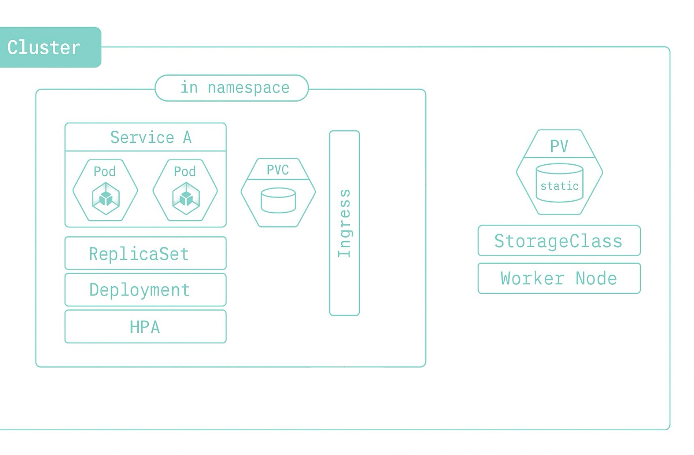

# K8s Namespaceについて

[English](../en/24_about_k8s_namespace.md) | [繁體中文](../zh-tw/24_about_k8s_namespace.md) | [日本語](../ja/24_about_k8s_namespace.md) | [インデックスに戻る](../README.md)

## Namespaceとは？

- NamespaceはKubernetesクラスター内の論理的なパーティションで、リソース（Pod、Service、Deploymentなど）の分離とグループ管理を行うために使用されます。
- 各Namespace内のリソース名は一意である必要がありますが、異なるNamespaceでは同じ名前のリソースを持つことができ、互いに影響を与えません。

## リソースの階層

- 一つのClusterには複数のNamespaceを含めることができます。
- **Namespaceに配置可能なリソース**：
  - Service（サービス）
  - Pod（コンテナインスタンス）
  - ReplicaSet（レプリカセット）
  - Deployment（デプロイメント）
  - HPA（Horizontal Pod Autoscaler）
  - PVC（PersistentVolumeClaim）
  - Ingress（トラフィック入口）
- **Namespaceに配置できない（Clusterレベルの）リソース**：
  - PV（PersistentVolume）
  - StorageClass
  - Node（Worker Node）
- 「Namespaceに配置可能」なリソースは互いに分離されており、「Namespaceに配置できない」リソースはCluster全体で共有されます。

## NodeとNamespaceの関係

- 一つのNode（ホスト）は複数のNamespaceからのPodを同時に実行できます。
- つまり、Podは論理的には異なるNamespaceに属していても、実際には同じNode上で実行される可能性があります。
- これは、Nodeが「物理的または仮想的な計算リソース」であり、Namespaceが「論理的なパーティション」であることを意味します。
- 例：
  - 一つのWorker Node上で、default、app001、app002など異なるNamespaceのPodが同時に実行される可能性があります。
  - これらのPodは論理的に分離されていますが、物理的には同じNodeのリソースを共有しています。

## Namespaceによる分離

- 一つのClusterには複数のNamespaceを持つことができます。例えば：
  - kube-system（システム用Namespace）
  - default（デフォルトNamespace）
  - app001、app002（カスタムアプリケーションNamespace）
- 各Namespaceには独自のService、Pod、ReplicaSet、Deployment、PVCなどを持つことができます。
- IngressはNamespace間でトラフィックルーティングを管理できます。
- Namespaceにより、異なるチームやアプリケーションが同じCluster内で互いに干渉することなく共存でき、権限制御とリソース配分が容易になります。
- **Namespaceを削除することで、そのNamespace下のすべてのリソース（Pod、Service、Deployment、PVCなど）を一括で削除できます。これはテスト環境や一時的なプロジェクトのクリーンアップに非常に便利です。**
- **注意：Clusterレベルのリソース（PV、StorageClass、Nodeなど）はNamespaceが削除されても消失しません。**

## まとめ

- NamespaceはKubernetesクラスターにおけるリソース分離の基本単位です。
- 異なる環境（dev、test、prodなど）や異なるプロジェクト、チームを区別するのに適しています。
- PV、StorageClass、NodeはClusterレベルに属し、PVCはNamespaceレベルに属します。
- 一つのNodeは複数のNamespaceのPodを同時に実行できます。Namespaceは論理的な分離のみを提供し、Nodeは物理的または仮想的な計算リソースです。
- Namespaceを適切に使用することで、管理効率とセキュリティを向上させることができます。