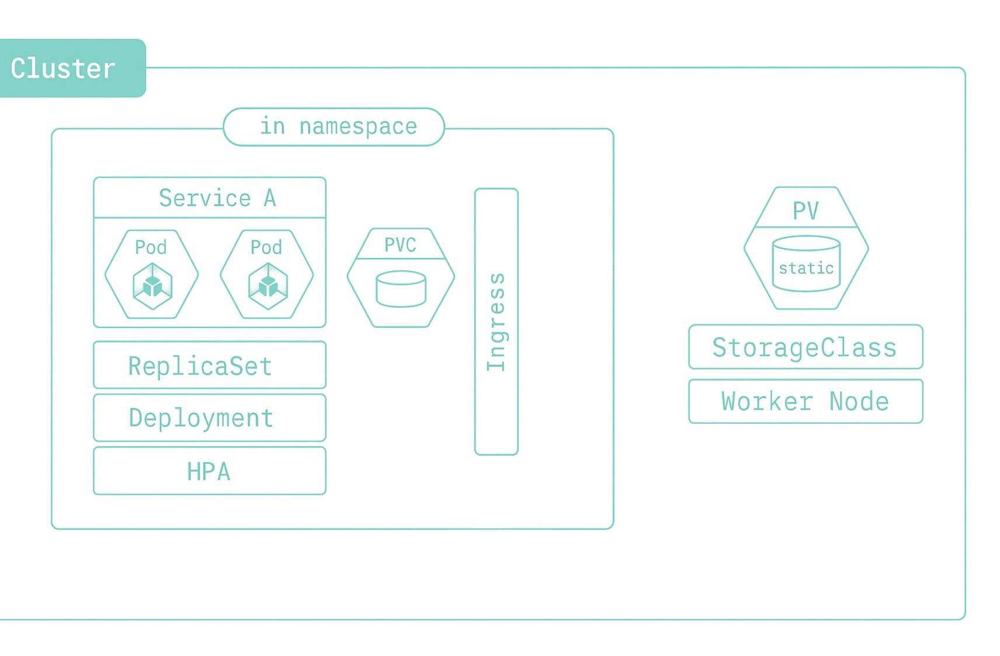

# 關於 K8s Namespace

[English](../en/24_about_k8s_namespace.md) | [繁體中文](../zh-tw/24_about_k8s_namespace.md) | [日本語](../ja/24_about_k8s_namespace.md) | [回到索引](../README.md)

## 什麼是 Namespace？

- Namespace 是 Kubernetes 叢集（Cluster）中的一種邏輯分區，用來將資源（如 Pod、Service、Deployment 等）做隔離與分組管理。
- 每個 Namespace 內的資源名稱必須唯一，但不同 Namespace 可以有同名資源，彼此互不影響。

## 資源的層級

- 一個 Cluster 裡可以有多個 Namespace。
- **可以放進 Namespace 的資源**：
  - Service（服務）
  - Pod（容器實例）
  - ReplicaSet（副本集）
  - Deployment（部署）
  - HPA（自動水平擴展）
  - PVC（PersistentVolumeClaim，持久化儲存宣告）
  - Ingress（流量入口）
- **不能放進 Namespace（屬於 Cluster 級別）的資源**：
  - PV（PersistentVolume，持久化儲存）
  - StorageClass
  - Node（Worker Node）
- 這些「可以放進 Namespace」的資源，彼此隔離；「不能放進 Namespace」的資源則是整個 Cluster 共用。

## Node 與 Namespace 的關係

- 一個 Node（主機）可以同時運行來自多個 Namespace 的 Pod。
- 也就是說，Pod 雖然在邏輯上屬於不同的 Namespace，但實際上都可能被排程到同一台 Node 上執行。
- 這代表 Node 是「實體或虛擬的運算資源」，Namespace 則是「邏輯分區」。
- 舉例：
  - 一台 Worker Node 上，可能同時有 default、app001、app002 等不同 Namespace 的 Pod 在運行。
  - 這些 Pod 在邏輯上隔離，但在物理上共用同一台 Node 的資源。

## 透過 Namespace 區隔

- 一個 Cluster 裡可以有多個 Namespace，例如：
  - kube-system（系統用 Namespace）
  - default（預設 Namespace）
  - app001、app002（自訂應用 Namespace）
- 每個 Namespace 內可以有自己的 Service、Pod、ReplicaSet、Deployment、PVC 等。
- Ingress 可以跨 Namespace 管理流量導向。
- Namespace 讓不同團隊或應用在同一個 Cluster 裡互不干擾，方便權限控管與資源分配。
- **透過刪除 Namespace，可以一次性刪除該 Namespace 下所有的資源（如 Pod、Service、Deployment、PVC 等），這對於測試環境或臨時專案的清理非常方便。**
- **注意：Cluster 級別的資源（如 PV、StorageClass、Node）不會因為 Namespace 被刪除而消失。**

## 小結

- Namespace 是 Kubernetes 叢集資源隔離的基礎單位。
- 適合用來區分不同環境（如 dev、test、prod）或不同專案、團隊。
- PV、StorageClass、Node 屬於 Cluster 級別，PVC 屬於 Namespace 級別。
- 一個 Node 可以同時運行多個 Namespace 的 Pod，Namespace 只是邏輯隔離，Node 則是實體或虛擬的運算資源。
- 善用 Namespace 可以提升管理效率與安全性。
